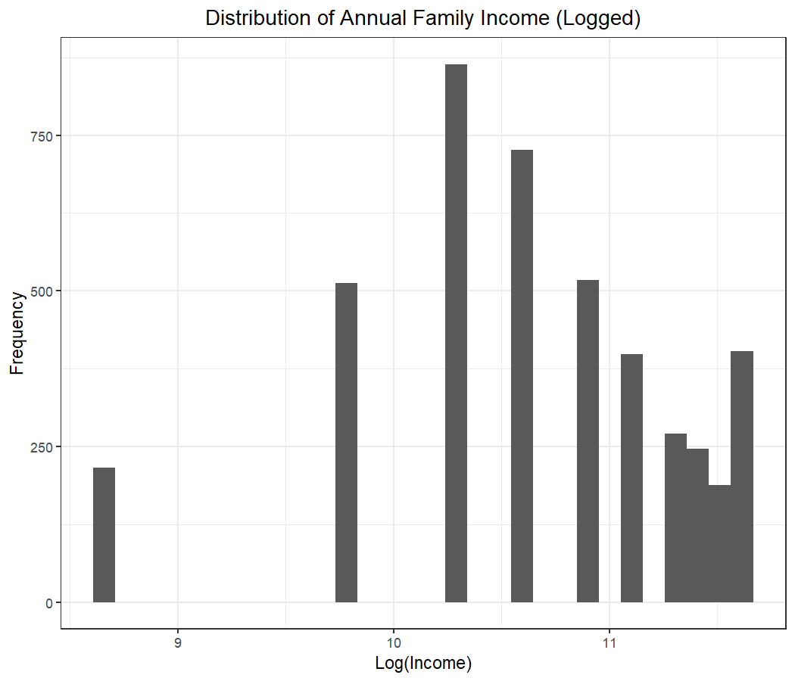
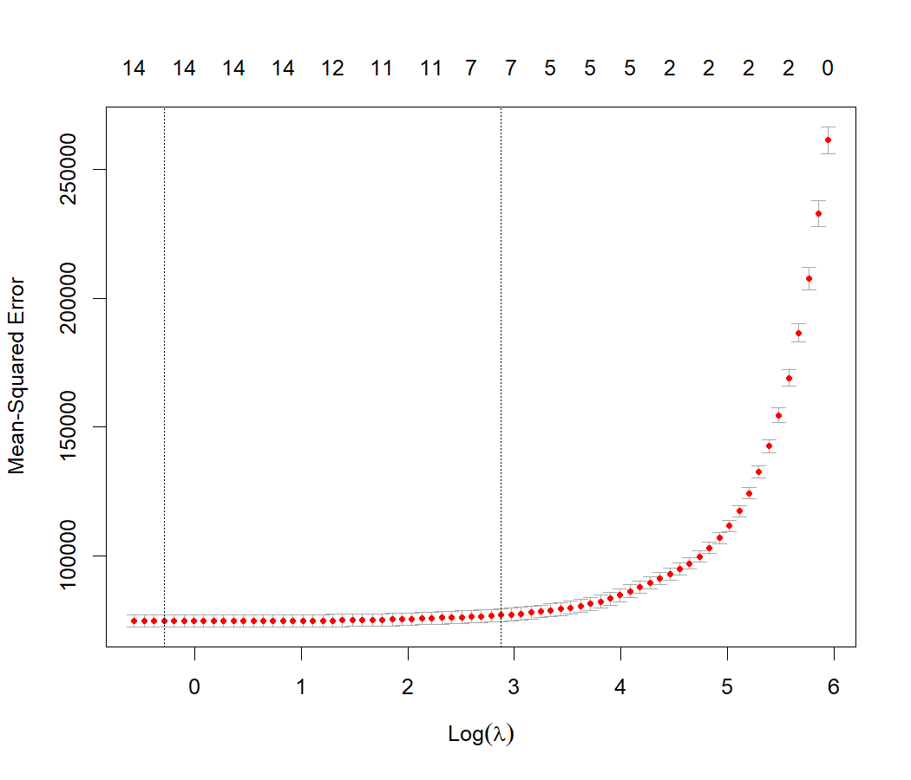
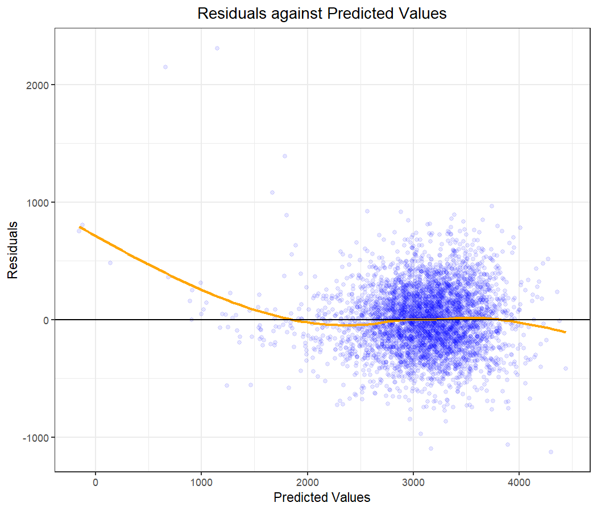
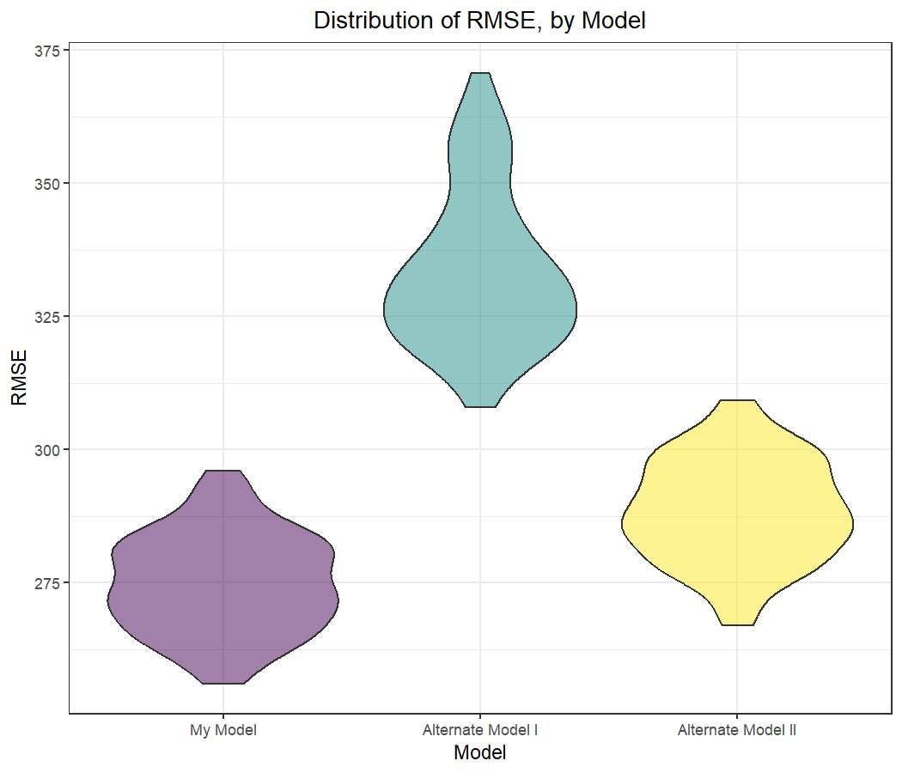

P8105_hw6_zk2275
================
Zhuodiao Kuang
2023-11-23

- [Problem 1](#problem-1)
- [Problem 2](#problem-2)
  - [Bootstrap](#bootstrap)
- [Problem 3](#problem-3)
  - [Preliminary Analysis](#preliminary-analysis)
  - [Model Selection](#model-selection)
  - [Model Comparison](#model-comparison)

<!------------------------------------------------------------------------------
Preamble
------------------------------------------------------------------------------->
<!------------------------------------------------------------------------------
Problem 1
------------------------------------------------------------------------------->

# Problem 1

<!------------------------------------------------------------------------------
Problem 2
------------------------------------------------------------------------------->

# Problem 2

We now switch to Central Park weather data. Our goal is to estimate the
parameters related to the linear relationship between the maximum and
minimum daily temperatures through a bootstrapping procedure.

``` r
# pull weather data from rnoaa
weather_df <-
  rnoaa::meteo_pull_monitors(
      c("USW00094728")
    , var      = c("PRCP", "TMIN", "TMAX")
    , date_min = "2017-01-01"
    , date_max = "2017-12-31"
  ) |>
  mutate(
      name = recode(id, USW00094728 = "CentralPark_NY")
    , tmin = tmin / 10
    , tmax = tmax / 10
  ) |>
  select(name, id, everything())
```

## Bootstrap

We consider the SLR as follows:

$$\text{temp}_t^{\text{max}} = \beta_0 + \beta_1 \text{temp}_t^{\text{min}} + \varepsilon_t$$

for each day $t$ in 2017. We create 5,000 resampled replicates of our
weather data and run the above regression for each one.

<!------------------------------------------------------------------------------
Problem 3
------------------------------------------------------------------------------->

# Problem 3

## Preliminary Analysis

By using data on mothers, fathers, and the infants themselves, we hope
to find potential predictors of infant birth weight. We import our
dataset below and factorize variables as needed.

``` r
# construct tidied dataset of birth weight and potential predictors
birthweight <-
  # pull in csv
  read_csv("birthweight.csv") |>
  # factorize variables where appropriate
  mutate(
    # recode babysex as a binary factor variable
    babysex = factor(recode(
      babysex
    , `1` = "Male"
    , `2` = "Female"
    ))
    # recode mrace as a factor variable
  , mrace = factor(recode(
      mrace
    , `1` = "White"
    , `2` = "Black"
    , `3` = "Asian"
    , `4` = "Puerto Rican"
    , `8` = "Other"
    ))
    # recode frace as a factor variable, noting it has an additional level
  , frace = factor(recode(
      frace
    , `1` = "White"
    , `2` = "Black"
    , `3` = "Asian"
    , `4` = "Puerto Rican"
    , `8` = "Other"
    , `9` = "Unknown"
    ))
    # recode malform as a binary factor variable
  , malform = factor(recode(
      malform
    , `0` = "Absent"
    , `1` = "Present"
    ))
    )

# create parents' races for further analysis
birthweight <- birthweight |>
  mutate( prace = factor(
      ifelse((mrace == "Black" & frace == "Black"), "Black",
      ifelse((mrace == "White" & frace == "White"), "White", "Other")
            )
                        )
      )
```

Note that, the dataset contains no missing values.

``` r
# show that all cell entries are non-missing
all(!is.na(birthweight))
```

    [1] TRUE

Cleaning is therefore an easy task. Having said that, we narrow down and
eliminate some of the predictors that might not be relevant for our
analysis in the sections that follow. Regression analysis may not always
be appropriate even when all of the data are clean.

### Predictor: Race of Parents

We have created the variable `prace`, which can indicate one of three
things for a given observation: (1) both parents are black, (2) both
parents are white, or (3) the parents are any other combination of
races. We do this because scenarios (1) and (2) together capture about
92% of observations. As such, the variable `prace` is in line with the
principle of parsimony, and hence we will employ `prace` in place of
`mrace` and `frace`.

### Predictor: Incidence of Prior Problematic Pregnancy

We first observe that the variables `pnumlbw` and `pnumsga` consist
solely of zeroes. As they offer no variation, they are not suitable for
prediction in this dataset, so we will omit them from our analysis.

``` r
# show that pnumlbw is always zero
all(pull(birthweight, pnumlbw) == 0)
```

    [1] TRUE

``` r
# show that pnumsga is always zero
all(pull(birthweight, pnumsga) == 0)
```

    [1] TRUE

### Predictor: Incidence of Malformations

Intuitively, the `malform` variable, which indicates the presence of any
malformations that might impact birth weight, seems like an excellent
candidate for a predictor of birth weight! Unfortunately, in our
dataset, only 15 observations indicate the presence of such a
malformation. While this lack of variation is not as extreme as that of
`pnumlbw` or `pnumsga`, we will still opt to omit this candidate
predictor from our analysis.

### Predictor: Change in Weight

By construction, we have that `wtgain` $\equiv$ `delwt` - `ppwt`. That
is, a mother’s weight gain during pregnancy is tautologically the
difference between her weight at delivery and her weight prior to
pregnancy. We show this is true empirically, as well, just as a sanity
check.

``` r
# show that wtgain = delwt - ppwt tautologically
all(
  birthweight |>
  # define test variable that returns TRUE if wtgain = delwt - ppwt
  mutate(wtgain_compare = wtgain == (delwt - ppwt)) |>
  # pull test variable to be evaluated by the all function
  pull(wtgain_compare)
)
```

    [1] TRUE

As such, including `wtgain`, `delwt`, and `ppwt` simultaneously as
predictors would introduce perfect multicollinearity into our model. In
particular, if $X$ is our data matrix, $X^t X$ would have no inverse,
and hence our projection matrix would be undefined. Fortunately, even if
we had not noticed this linear dependence, the `lm` function would have
been clever enough to drop one of the three predictors. However, we
*have* noticed this issue, and hence we will omit `wtgain` from our
analysis. The choice of which variable to omit is arbitrary, of course,
but we prefer to retain the variables that were measured directly.

### Predictor: Family Income

The `fincome` variable is a bit tricky. Should we consider the logarithm
of `fincome`? Values denote monthly income in hundreds, rounded.
Moreover, values seem to be top-coded at 96, such that any family with a
household salary exceeding \$114,600 is grouped into the same category.
Because of this arbitrary cap, `fincome` does not seem log-normal, as
shown below. (Note: As $\log(0) = -\infty$, we omit the single
observation for which `fincome` = 0.)

``` r
# ploot histogram of log(income)
birthweight |>
  # omit single row for which fincome = 0
  filter(fincome > 0) |>
  # instantiate plot
  ggplot(aes(x = log(100 * 12 * fincome))) +
  # add histogram
  geom_histogram() +
  # add meta-data
  labs(
      title = "Distribution of Annual Family Income (Logged)"
    , x     = "Log(Income)"
    , y     = "Frequency"
  )
```



Should `fincome` be a factor variable? There are 12 levels of `fincome`,
so even if none of the levels truly predict `bwt`, there is a 46% chance
that at least one level would wrongly appear as significant at
significance level $\alpha$ = 0.05. As such, it does not seem that
factorizing `fincome` is appropriate, either. After all of this
deliberation, we conclude it is best to simply leave `fincome` as is - a
continuous random variable recorded discretely.

## Model Selection

While we have eliminated variables that are obviously bad choices for
predictors of birth weight, we will turn to machine learning to
eliminate those that are less obviously bad. In particular, we invoke
the `glmnet` function to conduct a lasso regression. Below, we use
`model.matrix` to convert factor variables to dummy variables, which we
can then feed to `glmnet` to obtain the near-optimal choice of
$\lambda$, the shrinkage penalty.

``` r
# identify output vector y
y <- pull(birthweight, bwt)

# set up input matrix x
x <- birthweight %>% select(
    # output
    bwt
    # baby inputs
  , babysex, bhead, blength
    # mom inputs
  , delwt, gaweeks, menarche, mheight, momage, parity, ppbmi, ppwt, smoken
    # family inputs
  , fincome, prace
  )

# convert factor variables to dummy variables
x <- model.matrix(~ ., dplyr::select(x, -bwt))[, -1]

# set a seed since results can vary slightly from iteration to iteration
set.seed(8105)

# conduct lasso for various choices of lambda
cv_model <- cv.glmnet(x, y, alpha = 1)
plot(cv_model)
```



Per the algorithm’s recommendation, we see that `lambda.1se` (the value
of $\lambda$ corresponding to the center vertical dashed line) yields an
MSE very close to that of `lambda.min` (the value of $\lambda$
corresponding to the left vertical dashed line). As such, we can choose
a parsimonious model without losing much predictive power. Below are
seven variables that survive the second-stage culling.

``` r
# create data frame of the selected variables after lasso
coef(cv_model, s = cv_model[["lambda.1se"]]) 
```

    16 x 1 sparse Matrix of class "dgCMatrix"
                           s1
    (Intercept) -5582.1882892
    babysexMale     .        
    bhead         128.4857859
    blength        74.6339610
    delwt           1.5154889
    gaweeks         9.0623633
    menarche        .        
    mheight         0.6248394
    momage          .        
    parity          .        
    ppbmi           .        
    ppwt            .        
    smoken         -1.6081589
    fincome         .        
    praceOther      .        
    praceWhite    101.2831114

We finally have our model! All that’s left is to run the regression and
compare our residuals to our fitted values.

``` r
# fit final model
final_model <- lm(
    # ouput
    bwt
    # baby inputs post-lasso
  ~ bhead + blength
    # mom inputs post-lasso
  + delwt + gaweeks + mheight + smoken
    # family inputs post-lasso
  + prace
  , data = birthweight
)

# output statistics for estimators
final_model %>%
  summary() %>%
  broom::tidy() %>%
  knitr::kable()
```

<table>
<thead>
<tr>
<th style="text-align:left;">
term
</th>
<th style="text-align:right;">
estimate
</th>
<th style="text-align:right;">
std.error
</th>
<th style="text-align:right;">
statistic
</th>
<th style="text-align:right;">
p.value
</th>
</tr>
</thead>
<tbody>
<tr>
<td style="text-align:left;">
(Intercept)
</td>
<td style="text-align:right;">
-6185.321072
</td>
<td style="text-align:right;">
134.9013911
</td>
<td style="text-align:right;">
-45.850684
</td>
<td style="text-align:right;">
0.0000000
</td>
</tr>
<tr>
<td style="text-align:left;">
bhead
</td>
<td style="text-align:right;">
130.093971
</td>
<td style="text-align:right;">
3.4196146
</td>
<td style="text-align:right;">
38.043459
</td>
<td style="text-align:right;">
0.0000000
</td>
</tr>
<tr>
<td style="text-align:left;">
blength
</td>
<td style="text-align:right;">
75.257143
</td>
<td style="text-align:right;">
2.0259973
</td>
<td style="text-align:right;">
37.145727
</td>
<td style="text-align:right;">
0.0000000
</td>
</tr>
<tr>
<td style="text-align:left;">
delwt
</td>
<td style="text-align:right;">
2.070524
</td>
<td style="text-align:right;">
0.2114259
</td>
<td style="text-align:right;">
9.793144
</td>
<td style="text-align:right;">
0.0000000
</td>
</tr>
<tr>
<td style="text-align:left;">
gaweeks
</td>
<td style="text-align:right;">
12.486696
</td>
<td style="text-align:right;">
1.4554152
</td>
<td style="text-align:right;">
8.579474
</td>
<td style="text-align:right;">
0.0000000
</td>
</tr>
<tr>
<td style="text-align:left;">
mheight
</td>
<td style="text-align:right;">
5.197694
</td>
<td style="text-align:right;">
1.7581752
</td>
<td style="text-align:right;">
2.956301
</td>
<td style="text-align:right;">
0.0031303
</td>
</tr>
<tr>
<td style="text-align:left;">
smoken
</td>
<td style="text-align:right;">
-4.894465
</td>
<td style="text-align:right;">
0.5877564
</td>
<td style="text-align:right;">
-8.327371
</td>
<td style="text-align:right;">
0.0000000
</td>
</tr>
<tr>
<td style="text-align:left;">
praceOther
</td>
<td style="text-align:right;">
44.274894
</td>
<td style="text-align:right;">
16.2353519
</td>
<td style="text-align:right;">
2.727067
</td>
<td style="text-align:right;">
0.0064157
</td>
</tr>
<tr>
<td style="text-align:left;">
praceWhite
</td>
<td style="text-align:right;">
146.553247
</td>
<td style="text-align:right;">
9.3608750
</td>
<td style="text-align:right;">
15.655935
</td>
<td style="text-align:right;">
0.0000000
</td>
</tr>
</tbody>
</table>

``` r
# output statistics for overall model
final_model %>%
  summary() %>%
  broom::glance() %>%
  knitr::kable()
```

<table>
<thead>
<tr>
<th style="text-align:right;">
r.squared
</th>
<th style="text-align:right;">
adj.r.squared
</th>
<th style="text-align:right;">
sigma
</th>
<th style="text-align:right;">
statistic
</th>
<th style="text-align:right;">
p.value
</th>
<th style="text-align:right;">
df
</th>
<th style="text-align:right;">
df.residual
</th>
<th style="text-align:right;">
nobs
</th>
</tr>
</thead>
<tbody>
<tr>
<td style="text-align:right;">
0.7142938
</td>
<td style="text-align:right;">
0.7137663
</td>
<td style="text-align:right;">
274.0066
</td>
<td style="text-align:right;">
1354.116
</td>
<td style="text-align:right;">
0
</td>
<td style="text-align:right;">
8
</td>
<td style="text-align:right;">
4333
</td>
<td style="text-align:right;">
4342
</td>
</tr>
</tbody>
</table>

All of our variables appear as highly significant ($p$ \< 0.01), and our
adjusted $R^2 \approx$ 71.4%. Given our parsimonious selection of
variables, this seems like a good fit! Let’s compare our model residuals
to our model predictions to validate the results.

``` r
# plot scatter plot of residuals against fitted values
birthweight %>%
  # add predicted values
  add_predictions(final_model) %>%
  # add residuals
  add_residuals(final_model) %>%
  # instantiate plot
  ggplot(aes(x = pred, y = resid)) +
  # add points
  geom_point(alpha = 0.1, color = "blue") +
  # add smoothed lines
  geom_smooth(se = FALSE, color = "orange") + 
  # deepen line y = 0 for reference
  geom_hline(yintercept = 0, color = "black") + 
  # add meta-data
  labs(
    title = "Residuals against Predicted Values"
    , x = "Predicted Values"
    , y = "Residuals"
  )
```



There are two observations for which a negative birth weight is
predicted, but this is not unreasonable for an unconstrained linear
regression. Though the residuals tend to skew positive for fitted values
below 1,750, only about 1.08% of observations lie below this threshold.
Otherwise, residuals seem to generally be dispersed evenly about the
line $y = 0$. That is, outside the aforementioned outliers, the errors
seem to be mean-zero and homoscedastic.

## Model Comparison

Finally, we compare our model to two other linear model candidates. The
first model considers length at birth and gestational age in weeks as
inputs. The second model considers head circumference at birth, length
at birth, and sex of the child - as well as all possible interactions -
as inputs.

``` r
# create alt model with inputs blength and gaweeks
model_alt1 <- lm(bwt ~ blength + gaweeks, data = birthweight)

# create alt model with baby variables and all orders of interactions
model_alt2 <- lm(bwt ~ (bhead + blength + babysex)^3, data = birthweight)

# set seed since crossv_mc randomly assigns rows to the training dataset
set.seed(8105)

# create 100 training/testing partitions of the data
cv_split <-
  # use the default 80/20 split for each partition
  crossv_mc(birthweight, 100) %>% 
  # convert lists to tibbles
  mutate(
      train = map(train, as_tibble)
    , test  = map(test,  as_tibble)
  )

# construct data frame of rmses across models and across training/testing splits
rmse_df <-
  cv_split %>%
  # fit models to training data
  mutate(
      final = map(.x = train, ~ final_model)
    , alt1  = map(.x = train, ~ model_alt1)
    , alt2  = map(.x = train, ~ model_alt2)
  ) %>%
  # apply fitted modls to testing data for validation
  mutate(
    rmse_final = map2_dbl(.x = final, .y = test, ~rmse(model = .x, data = .y)),
    rmse_alt1  = map2_dbl(.x = alt1,  .y = test, ~rmse(model = .x, data = .y)),
    rmse_alt2  = map2_dbl(.x = alt2,  .y = test, ~rmse(model = .x, data = .y))
  ) %>%
  # retain only necessary columns
  select(rmse_final, rmse_alt1, rmse_alt2) %>%
  # pivot longer
  pivot_longer(
      cols         = everything()
    , names_to     = "model"
    , values_to    = "rmse"
    , names_prefix = "rmse_"
  ) %>%
  # factorize models to preserve ordering
  mutate(model = fct_inorder(model))

# create violin plot of distribution of rmse by model
rmse_df %>%
  # instantiate plot
  ggplot(aes(x = model, y = rmse, fill = model)) +
  # add violin chart
  geom_violin(alpha = 0.5) +
  # suppress legend
  theme(legend.position = "none") +
  # add meta-data
  labs(
      title = "Distribution of RMSE, by Model"
    , x     = "Model"
    , y     = "RMSE"
  ) +
  # add x-axis labels
  scale_x_discrete(labels = c(
      "My Model"
    , "Alternate Model I"
    , "Alternate Model II"
  ))
```



Our lasso-inspired model seems to generally perform the best, though the
model with interaction terms also seems to do well. Conversely, the
distribution of prediction errors for the model with only two inputs
lies entirely above that of our model, so we can confidently say that
our model is strictly better than this alternative. Moreover, in
addition to performing better on average, our model is much easier to
interpret than the model with interactions, as the effect of each input
in the latter model depends on the other two inputs. Thanks, lasso!
